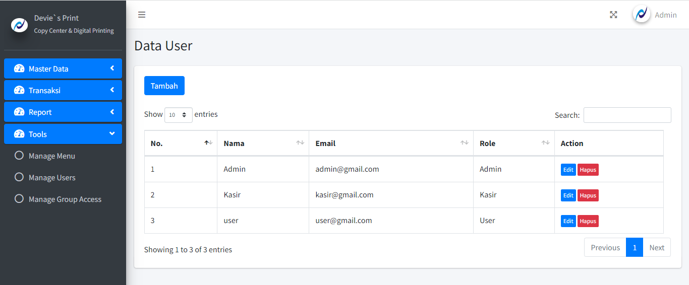
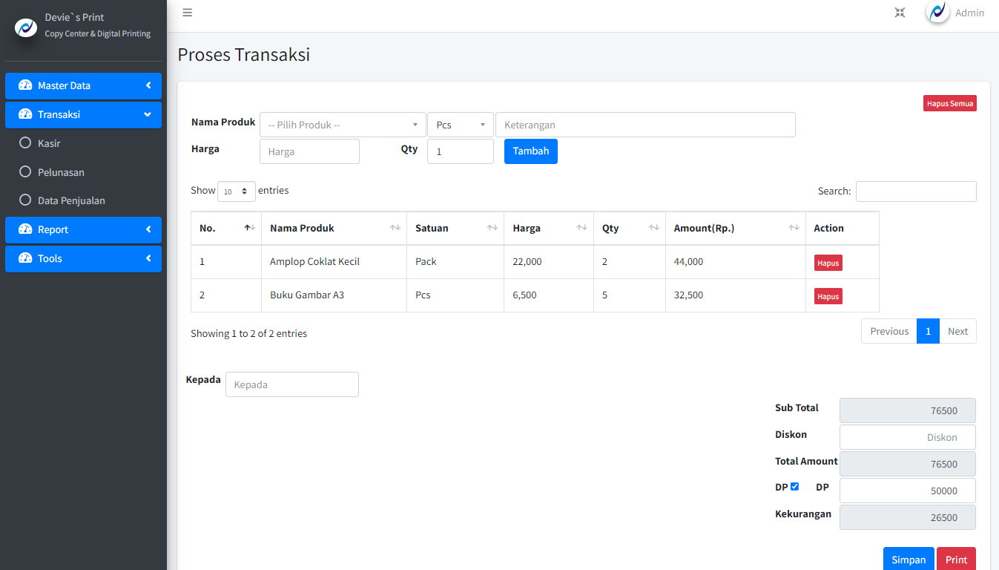
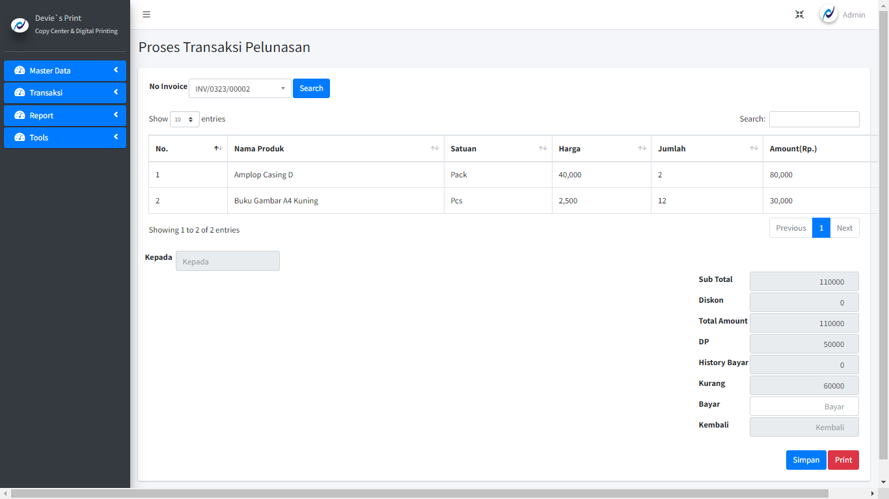
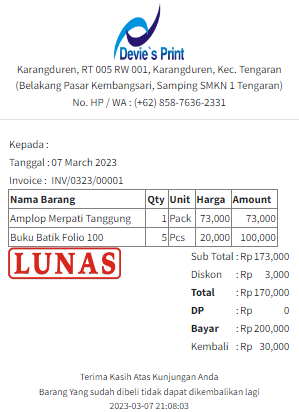
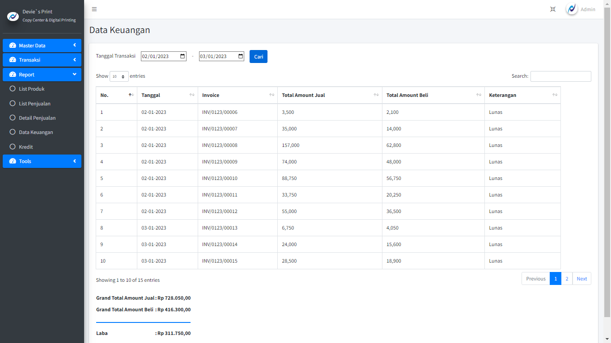

## Sistem Kasir

Sistem Kasir is a website that used to record sales and processing financial reports. Which this system has several flexible features.

-   Group Access can be customized as needed

-   Kasir has a down payment method

-   Down payment settlement transactions that can make payment transactions more than 1 time

-   Print struck with paid or unpaid status

-   Financial records and other supporting data

